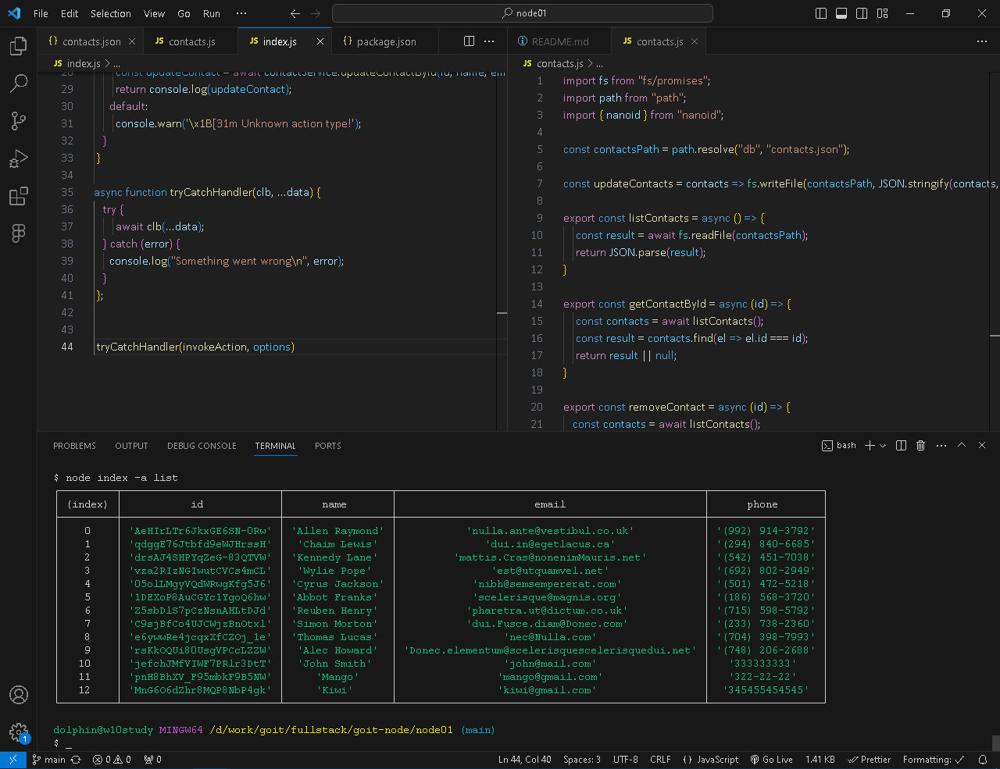
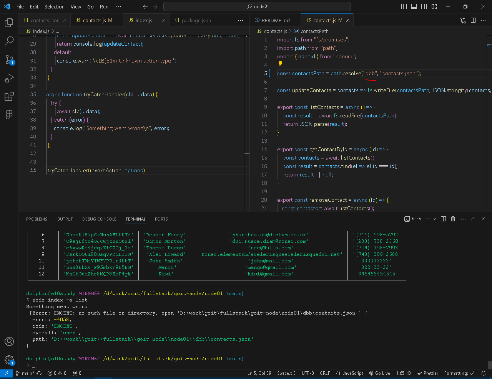
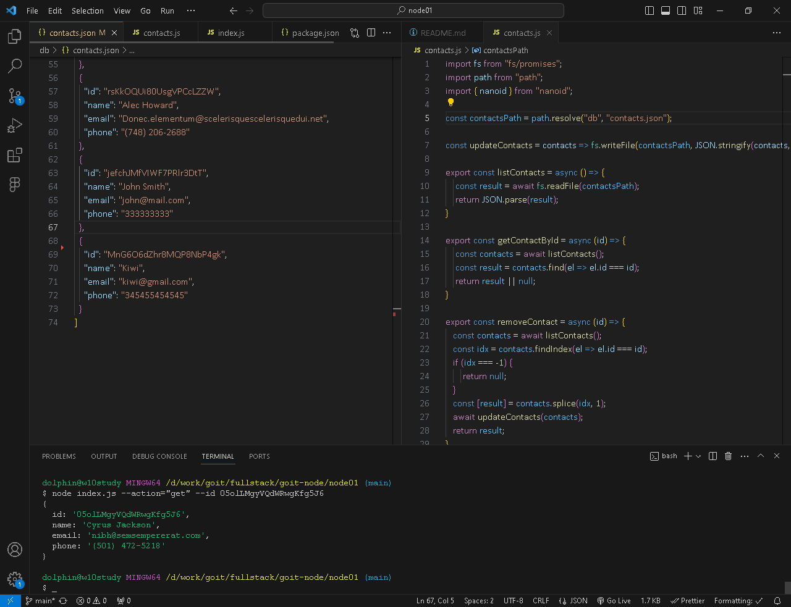
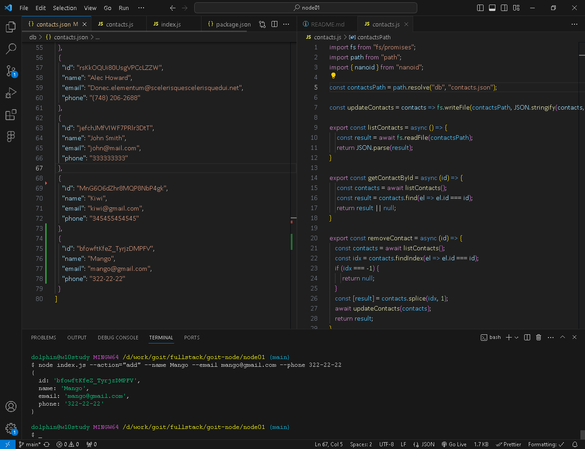
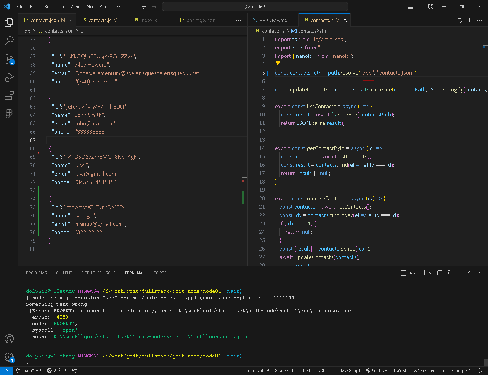
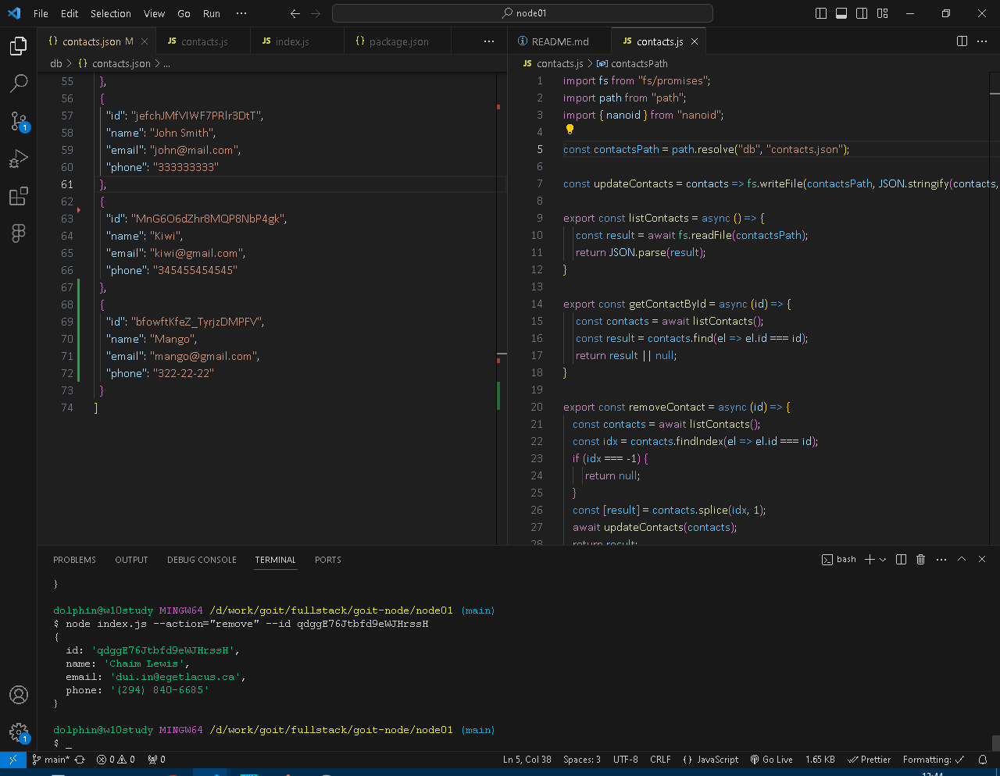
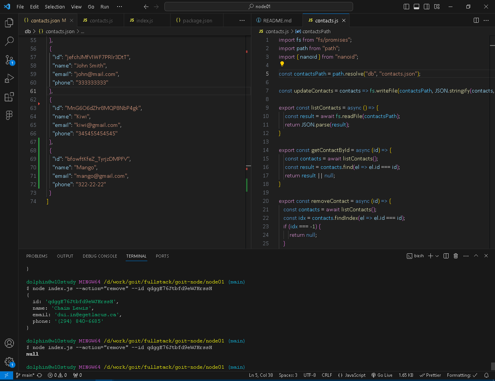
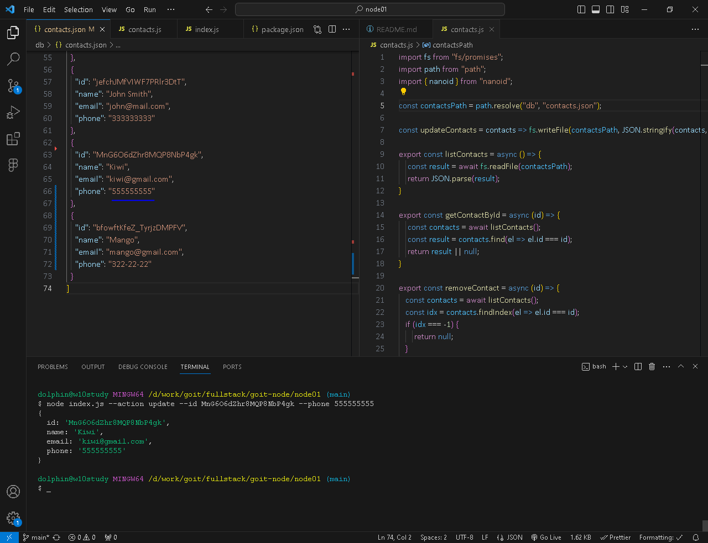
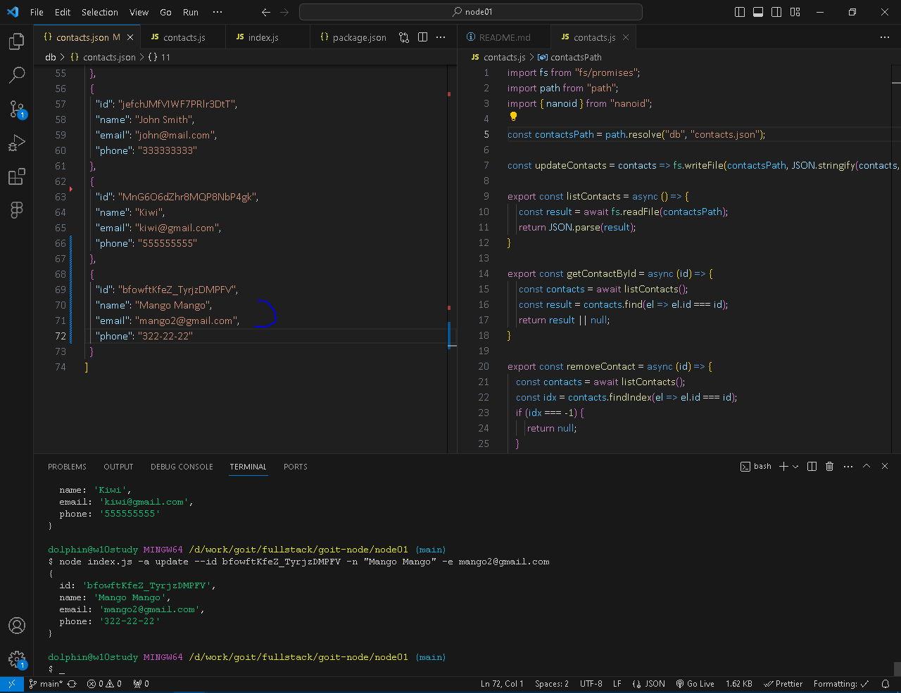
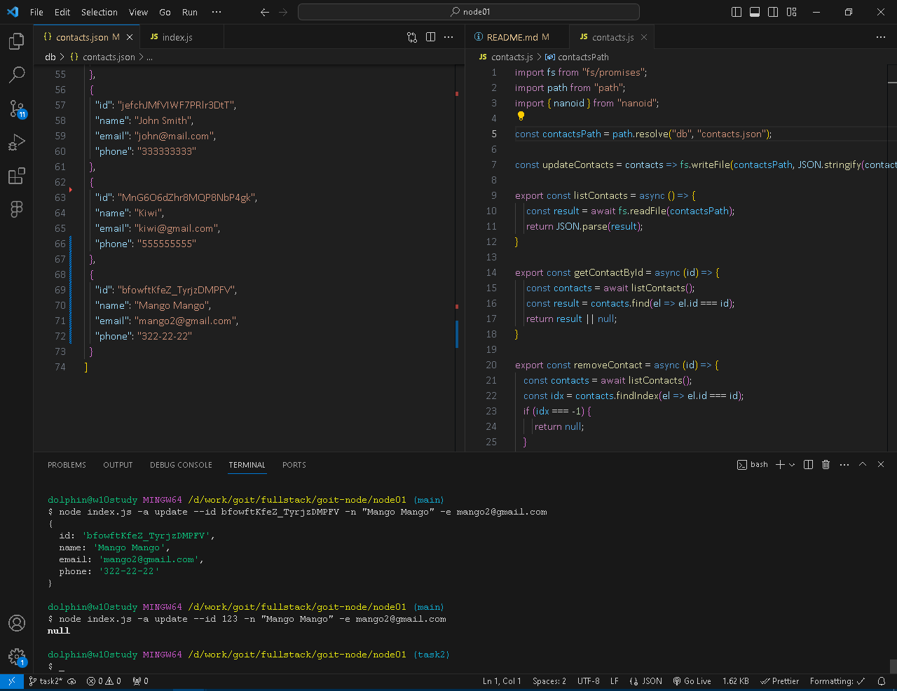

# Результати роботи команд

## 1. Отримуємо і виводимо весь список контактів у вигляді таблиці
```command
node index.js --action="list"
```
### Результат


### У випадку помилки



## 2. Отримуємо контакт по id і виводимо у консоль об'єкт контакту або null, якщо контакту з таким id не існує.
```command
node index.js --action="get" --id 05olLMgyVQdWRwgKfg5J6
```
### Результат



## 3. Додаємо контакт та виводимо в консоль об'єкт новоствореного контакту
```command
node index.js --action="add" --name Mango --email mango@gmail.com --phone 322-22-22
```
### Результат


### У випадку помилки



## 4. Видаляємо контакт та виводимо в консоль об'єкт видаленого контакту або null, якщо контакту з таким id не існує.
```command
node index.js --action="remove" --id qdggE76Jtbfd9eWJHrssH
```
### Результат якщо контакт з таким id існує


### Якщо контакту з таким id не існує



## 5. Оновлюємо контакт по id і виводимо у консоль об'єкт контакту або null, якщо контакту з таким id не існує.
### Результат оновлення тільки телефону
```command
node index.js --action update --id MnG6O6dZhr8MQP8NbP4gk --phone 555555555
```


### Результат оновлення імені та імейлу
```command
node index.js -a update --id bfowftKfeZ_TyrjzDMPFV -n "Mango Mango" -e mango2@gmail.com
```


### Якщо контакту з таким id не існує

